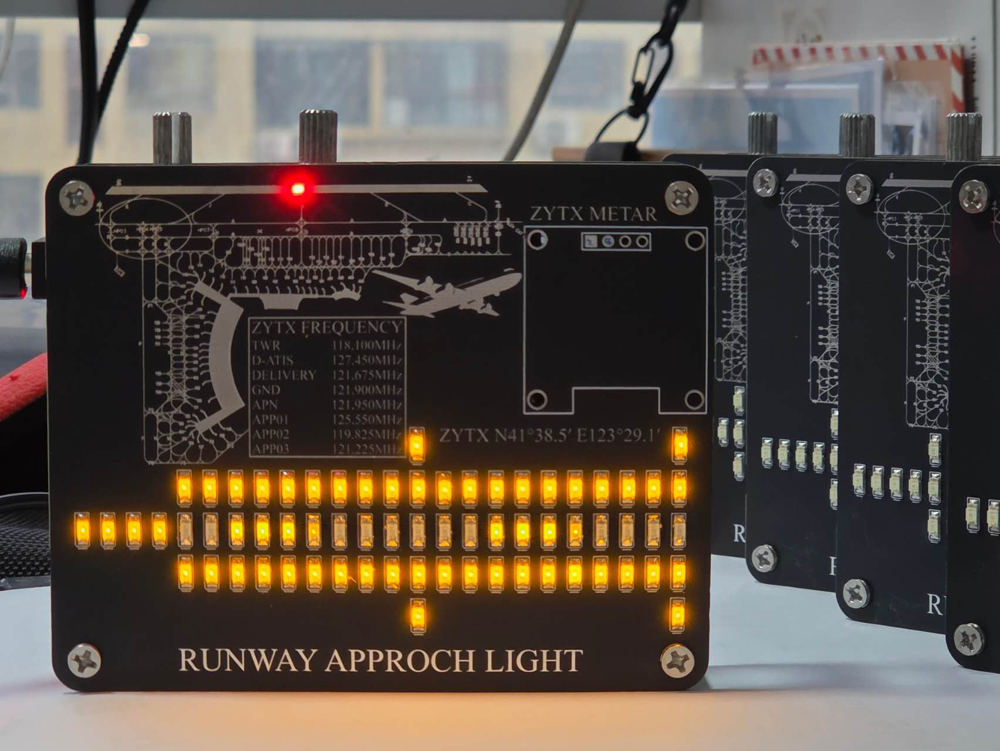
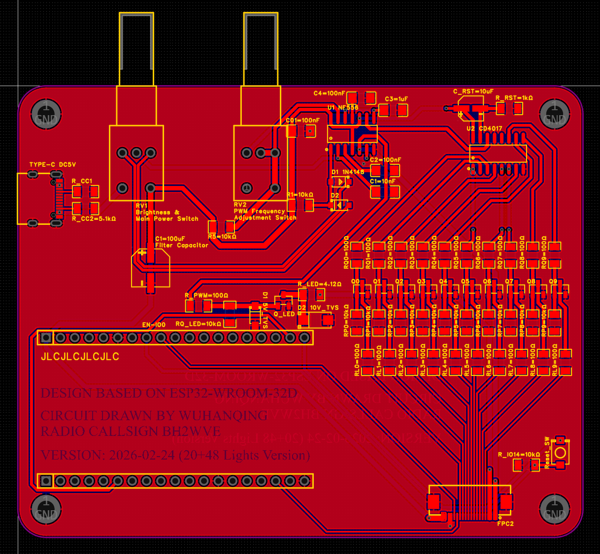
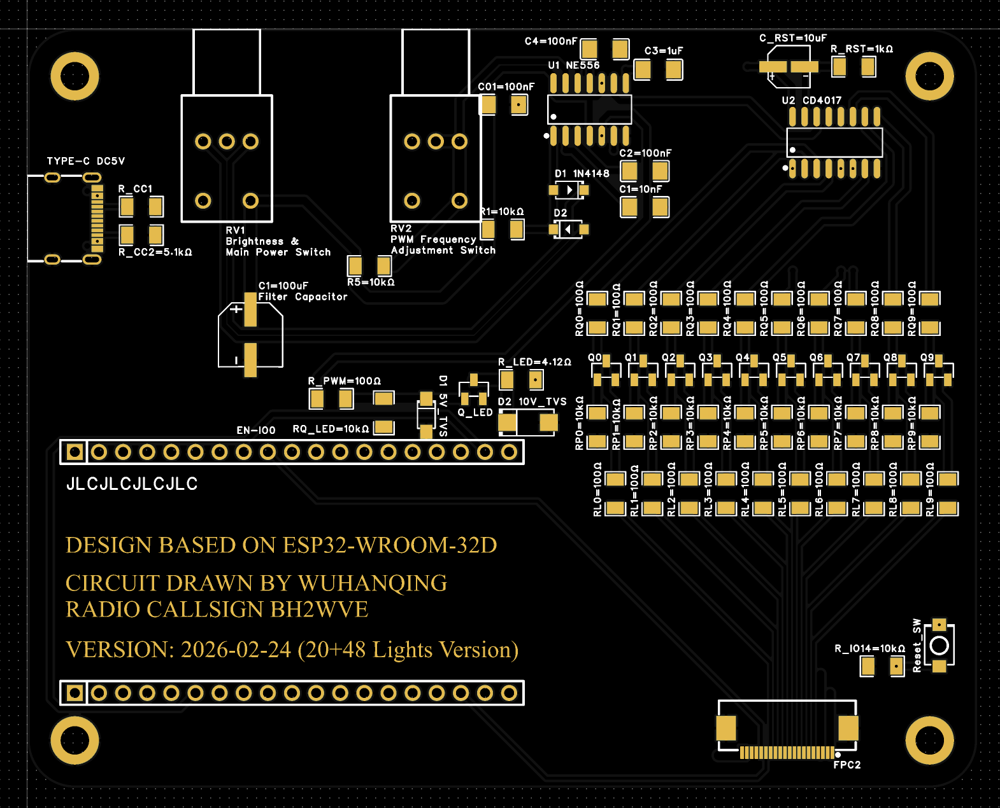
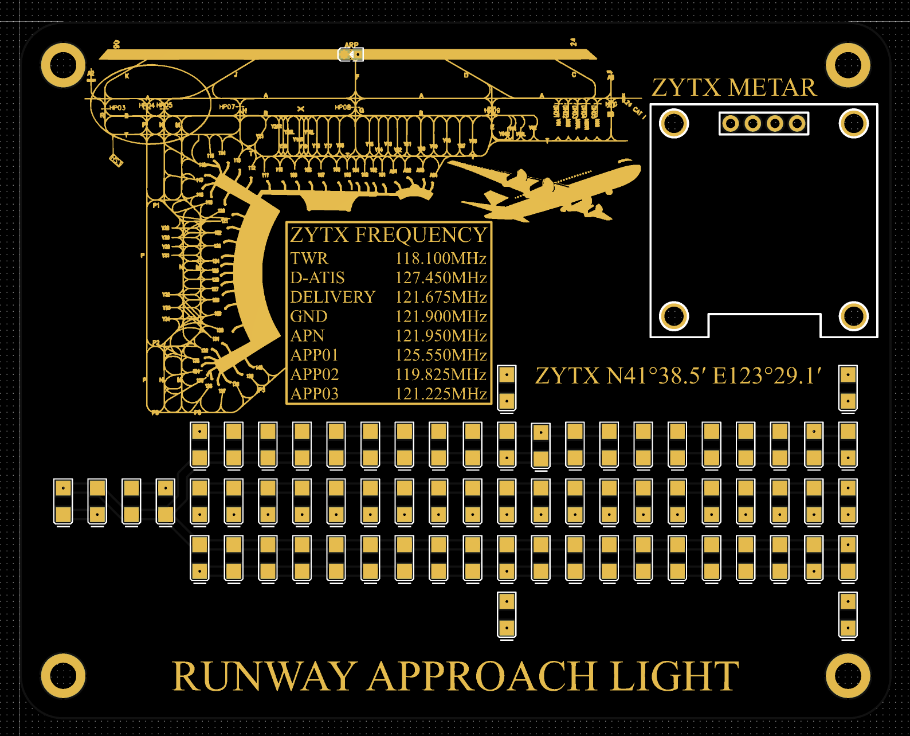

# ESP32 跑道进近灯摆件 说明文档及开源手册

本项目是一款高度还原 民航跑道进近灯光系统 的桌面智能摆件。它融合了 ESP32 微控制器 与 硬逻辑时序电路（NE556+CD4017），在实现拟真视觉效果的同时，能够实时抓取并显示全球机场的 METAR 与 TAF 气象报文。

---

# 📖 目录

[[#1. 摘要]]

[[#2. 功能特性]]

[[#3. 项目图片]]

[[#4. 使用方法与操作说明]]

[[#5. 系统设计原理]]

[[#6. 硬件清单 (BOM)]]

[[#7. 开源复刻注意事项]]

[[#8. 参考文献与技术标准]]

[[#9. 关于作者与技术支持]]

---

# 1. 摘要

本项目旨在设计并实现一个兼具装饰性与功能性的航空主题摆件。硬件层面，通过两层 PCB 堆叠结构，利用 NE556 双定时器和 CD4017 计数器实现了 20 路流水灯（跑兔灯）与 48 路常亮灯的混合驱动，并支持亮度和闪烁频率的硬件调节。软件层面，基于 MicroPython 开发，利用 ESP32 的 WiFi 能力实现 Web 配网与航空气象数据（METAR/TAF）的实时爬取。该项目不仅复现了机场跑道端的视觉美感，也为航空爱好者提供了一个实用的气象监控终端。

---

# 2. 功能特性

- **仿真灯效**：包含 20 盏流水引导灯（模拟顺序闪烁灯）及 48 盏常亮进近灯。
    
- **硬件交互**：
    
    - **左旋钮**：总电源开关及全局灯光亮度调节（PWM 调光）。
        
    - **右旋钮**：流水灯流动速度调节（频率调谐）。
        
    - **底板按键**：一键进入 WiFi 配网及 ICAO 代码配置模式。
        
- **智能信息显示**：0.96 寸 OLED 屏幕循环显示指定机场的原始 METAR 与 TAF 报文（5秒间隔）。
    
- **便捷配网**：支持热点（AP）配网，内置 Web 配置页面与二维码快速访问。
    
- **物理设计**：双层 PCB 结构（100mm x 80mm），正面集成机场平面图与无线电频率表（TWR, GND, APP等）。
    

---

# 3. 项目图片

## 3.1 实物图



## 3.2 电路图

### 3.2.1 底板电路图



### 3.2.2 顶板电路图


## 3.3 2D预览图

### 3.3.1 底板2D预览图



### 3.3.2 顶板2D预览图



## 3.4 电路原理图


---

# 4. 使用方法与操作说明

## 4.1 初始启动

1. **供电**：使用 Type-C 数据线连接底板左上方的接口（建议 5V/1A 及以上电源）。
    
2. **开机**：顺时针旋转**左侧旋钮**，红色电源指示灯亮起，灯组进入初始工作状态。
    
3. **调节**：
    
    - 旋转**左旋钮**调整全局亮度。
        
    - 旋转**右旋钮**改变跑道灯的闪烁流动速度。
        

## 4.2 配网与设置

若屏幕提示未连接或需要更改机场：

1. **进入模式**：长按底板右下方的轻触按键。
    
2. **扫码连接**：屏幕显示二维码及 IP `192.168.4.1`。
    
3. **操作**：手机连接 WiFi `METAR_Config`，扫码或在浏览器手动输入 IP 进入配置页面。
    
4. **提交**：输入 WiFi SSID、密码及目标机场 **ICAO 四字代码**（如沈阳桃仙 ZYTX），点击 Save。设备将自动重启并开始爬取气象数据。
    

---

# 5. 系统设计原理

## 5.1 硬件电路设计

系统采用“硬逻辑控制灯效，微处理器处理数据”的分工模式：

- **核心逻辑 (NE556 + CD4017)**：
    
    - **NE556 (Unit A)**：输出 1kHz 占空比可变波形，作为 **PWM 调光信号** 接入 LED 阳极。
        
    - **NE556 (Unit B)**：输出 3-100Hz 可变频率方波，作为 **时钟信号** 输入 CD4017。
        
    - **CD4017**：十位计数器，其输出端 Q0-Q9 通过 10 组 MOSFET 驱动 20 盏流水灯（两两并联）。
        
- **视觉仿真算法**：流水灯栅极（G）受 CD4017 时序控制，阳极受 PWM 调光控制。由于 PWM 频率（1kHz）远高于时序切换频率，实现了调速与调光效果的解耦叠加。
    

## 5.2 软件逻辑架构

- **语言环境**：MicroPython (using Thonny)。
    
- **数据采集**：通过 `urequests` 模块定期向航空气象 API 发起请求，获取指定 ICAO 代码的 JSON 数据，并解析出 `rawOb` (METAR) 和 `rawTAF` (TAF) 字符串。
    
- **显示控制**：使用 `ssd1306` 驱动控制 OLED，通过字符切分算法实现长报文的分行显示与自动滚动切换。
    

---

# 6. 硬件清单 (BOM)

![[picture/BOM.jpg]]
（详见本文件夹下的 `BOM_TOTAL_PCB.xlsx` 文档。）

---

# 7. 开源复刻注意事项

为保证本项目顺利复刻，请务必关注以下工程细节：

## 7.1 硬件与焊接要点

- **EDA 平台**：本项目基于 **嘉立创EDA (专业版)**。源文件为 `ProPrj_Runway_Approach_Light_2026-02-24.epro2`。
    
- **引脚对齐**：务必使用 **38 引脚版本** 的 ESP32 开发板（每侧 19 Pin），避免尺寸不兼容。
    
- **焊接工艺**：底板逻辑芯片（NE556/CD4017）需严防连焊。**MOSFET 驱动管**对温度极其敏感（耐温约 170℃），**务必最后焊接**，建议使用低温焊锡，单次焊接时间不宜超过 3 秒，避免热量堆积造成管子击穿或热损毁。
    

## 7.2 工具链与资源存放

本项目所需的所有配套软件及固件均已存放在目录下的 `tools` 文件夹中，结构如下：

```
tools/
├── 1-Thonny开发软件
├── 2-开发板CH340驱动
├── 3-ESP32-FLASH固件下载工具
└── 4-ESP32-MicroPython固件
    ├── esp32-20220618-v1.19.1.bin (推荐)
    ├── ESP32_GENERIC-20240602-v1.23.0.bin
    └── ESP32_GENERIC-20250415-v1.25.0.bin
```

> **固件说明**：虽然准备了多个版本，但为保证兼容性与稳定性，**强烈推荐烧录 `v1.19.1` 版本**。

## 7.3 核心开发步骤

1. **硬件自检**：焊接完成后首先进行上电测试，确认流水灯与常亮灯组硬件逻辑运行正常。
    
2. **驱动安装**：给电脑安装 `tools/2-开发板CH340驱动`，确保设备能被识别。
    
3. **固件烧录**：使用 `tools/3-ESP32-FLASH固件下载工具` 将推荐版本的 **MicroPython 固件** 烧写进 ESP32。
    
4. **环境配置**：安装并打开 **Thonny** 软件，解释器选择 ESP32。配置细节可参考 Bilibili “普中 ESP32 教程” 等相关视频。
    
5. **代码部署**：通过 Thonny 连接开发板，将项目源文件 `METAR.py` 上传并运行。
    
6. **最终装配**：确认软件运行无误后，将 ESP32 插入底板排母，完成整机组装并上电测试。
    

---

# 8. 参考文献与技术标准

## 8.1 国际标准与行业规范

- **文献名称**：**WMO-No.306_Vol_I.1_Manual_on_Codes.pdf**
    
    - **出版单位**：World Meteorological Organization (WMO)
        
    - **核心关联**：本项目 METAR/TAF 报文解析逻辑严格遵循该手册中 **FM 15 (METAR)** 与 **FM 51 (TAF)** 的字段定义与编码规则。
        
- **文献名称**：**ICAO_Annex_14_Vol_I_Aerodrome_Design_and_Operations.pdf**
    
    - **出版单位**：International Civil Aviation Organization (ICAO)
        
    - **核心关联**：本项目灯光排布及流水灯（Sequenced Flashing Lights）的时序要求参考了该标准 **Chapter 5.3.4** 关于进近灯光系统的相关规定。
        

## 8.2 关键元器件规格书

- **文献名称**：**C7434190_555定时器-计时器_NE556DR-MS_规格书_WJ411490.pdf**
    
    - **生产厂家**：MSKSEMI (美森科)
        
    - **核心关联**：用于设计双路 555 时基电路，实现系统调光 PWM 波形产生及 CD4017 时钟脉冲控制。
        
- **文献名称**：**C7473153_计数器-分频器_CD4017BM-MS_规格书_WJ411742.pdf**
    
    - **生产厂家**：MSKSEMI (美森科)
        
    - **核心关联**：用于实现 20 路跑道顺序闪烁灯（跑兔灯）的译码计数逻辑与硬件移位驱动。
        

---

# 9. 关于作者与技术支持

如果你在复刻过程中遇到技术难题，或者对本项目有改进建议，欢迎通过以下方式联系我：

## 9.1 作者信息

* **教育背景**：就读于 **庆熙大学 (Kyung Hee University, South Korea)** · 电子工程系
* **微信 (WeChat)**：`Daniel_Qinghan`
* **邮箱 (Email)**：[wuhanqing2005@gmail.com](mailto:wuhanqing2005@gmail.com)

## 9.2 技术交流群

* **QQ群**：`1087242118`（入群请备注：进近灯）

## 9.3 项目演示视频

<p align="center">
  <a href="https://www.bilibili.com/video/BV1fFtZz1Eyx" target="_blank">
    
  </a>
</p>

<div align="center">
    <br>
    <iframe 
        width="100%" 
        height="500px" 
        src="https://player.bilibili.com/player.html?bvid=BV1fFtZz1Eyx&page=1&as_wide=1&high_quality=1&danmaku=0&autoplay=0" 
        frameborder="0" 
        allowfullscreen>
    </iframe>
</div>
